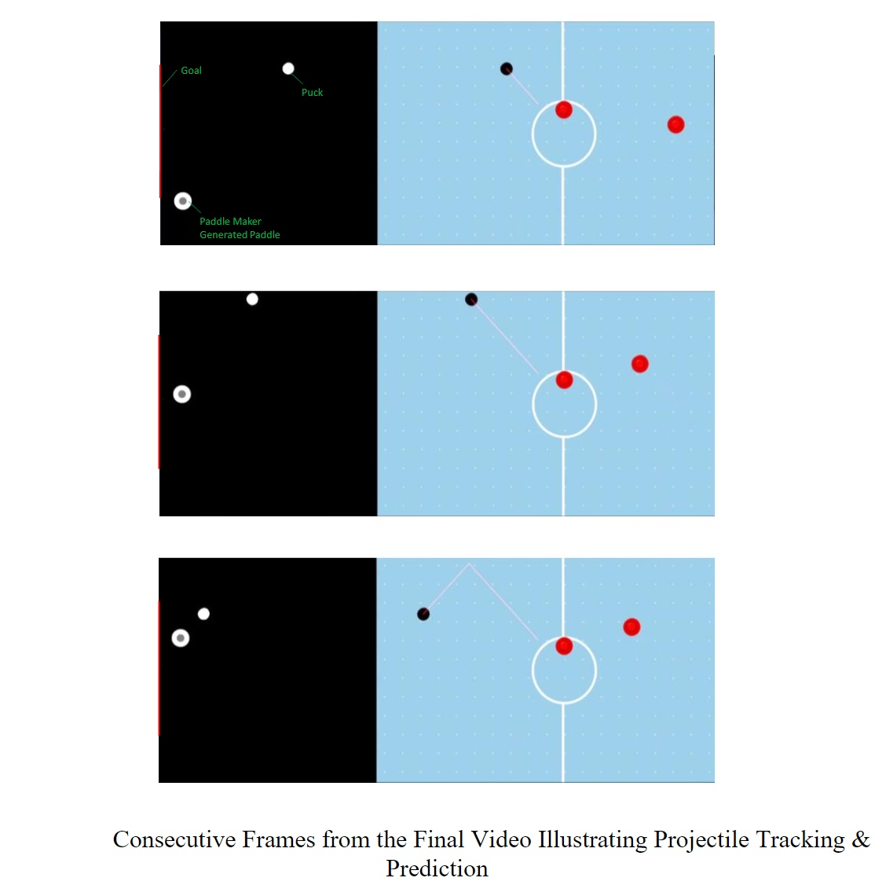

# 2D Projectile Tracking Software
## Summary
The development of a system capable of playing a game of air hockey against a human opponent is approached by developing tracking software and a physical apparatus. The tracking software was developed with C++ and implements the OpenCV library. It achieves a high level of fidelity in both tracking an air hockey puck and predicting its trajectory. 

## Features
* Achieves object detection, and consequently tracking, of the puck using image filtration processes via OpenCV
* Applies recursive algorithm to accurately predict coordinates for the system paddle to intercept an incoming puck 

## Demo Video:
Link: https://www.youtube.com/watch?v=H_wBN9Kxjrk&feature=youtu.be

## Relevant Screenshots:

